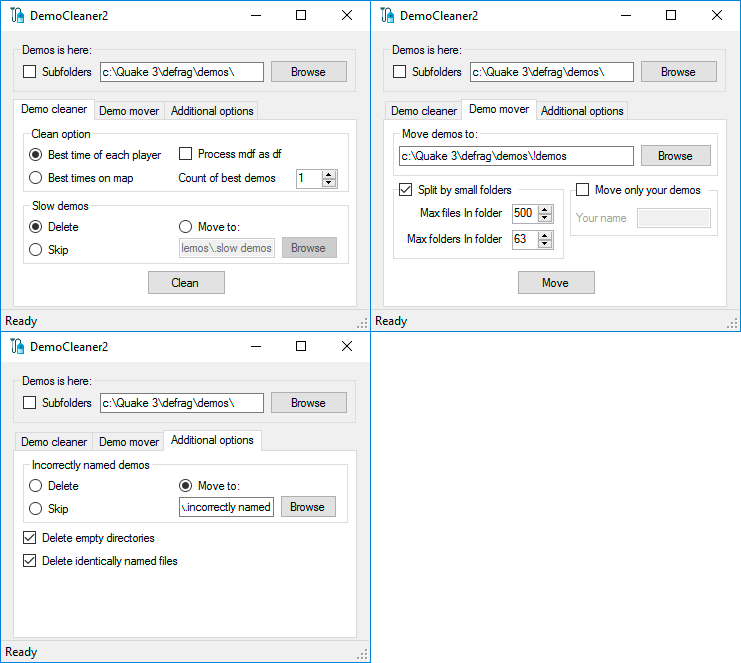

# Democleaner3
A program for processing (moving / deleting / renaming) demo files created when recording the completion of maps in Quake3.
And also for viewing information about demo (you can associate .dm_68 files with this program, and open demos with it).

## Download
https://github.com/ivan200/DemoCleaner3/raw/master/bin/Release/DemoCleaner3.exe

## Clean tab
Here you can clean up the folder with demos. If you have a large number of them, and they interfere with you, you can leave only the best of them, and remove the rest, or move to a specific folder.

## Move tab
Here it is possible to make the splitting of all the demos in the subdirectories. This is required because Quake 3 does not know how to display a large number of files in the directory with demos, cutting their display. Plus, if there are a lot of them, the search for a particular file gets worse.
Catalogs will be named on the initial letter of the demo (e.g. a\ark3...) and if the number of demos in such a directory exceeds the number of demos, additional directories will be created (e.g. a\ar\ark3...)

## Rename tab
In this tab you can view information about individual demo files and try to rename all incorrectly named demos in a batch, as well as check demos for compliance with the rules.
You probably have directories with stacks of demo files like "demo0001",so this section will help you to get normal names for them all.

## Screenshots

## Launching from the console
This program also supports the ability to run from the console. 
Example: `DemoCleaner3.exe [param] [demo_file] [external_file]?`

`[param]`: 
`--xml` - output information about `[demo_file]` to the console as xml 
`--json` - output information about `[demo_file]` to the console as json 
`--xml-file`- output information about `[demo_file]` as xml to the `[external_file]` or to the file `[demo_file].xml` 
`--json-file`- output information about `[demo_file]` as json to the `[external_file]` or to the file `[demo_file].json` 
`--rec` - create from [demo_file] - .rec file, and save it to the `[external_file]`, or to the file `[mapName]_[mod]_[physic].rec`

`[demo_file]`: 
The path to the demo file that the program will try to parse.
Supported formats: `.dm_68`, `.dm_67`, `.dm_66`

`[external_file]?`
Optional parameter of an additional output file.

# Developed By

* Zakharov Ivan
* mail: 79067180651@ya.ru
* skype: Ivan.1010
* discord: Enter#4725
* [Donate with Paypal](https://www.paypal.me/ivanz200)
